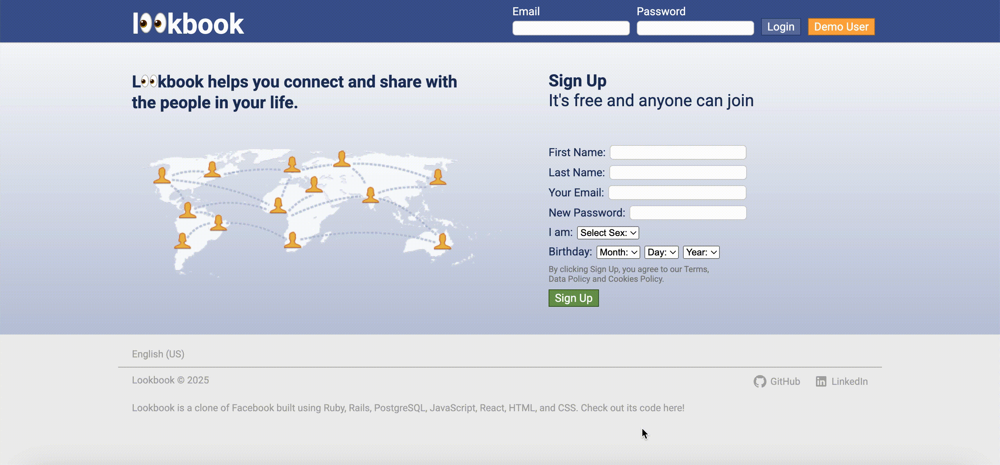
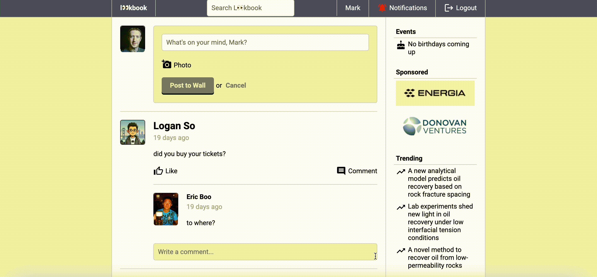

# Lookbook


[Live](https://lkbk-05bfd83b5c68.herokuapp.com/)

Lookbook is a clone of Facebook. The single page front end is built using React.js. The back end consists of a Rails API and a PostgreSQL database. In essence, the Rails application serves JSON resources to a React client delivered as a single HTML with JavaScript that consumes JSON data.

Try it out by clicking the "Demo User" button or create a new user profile. Let's connect and share with the people in your life!


## Features

### New User Sign Up

Inputs for new user sign up are currently only validated on the back end. Server-side validations occur at the model-level using the built-in Active Record validation helpers provided by Rails and custom validation methods. This way ensures that only valid data are saved into the database.

```rb
# app/models/user.rb
validates :first_name, presence: true, length: { maximum: 40 }
validates :last_name, presence: true, length: { maximum: 40 }
validates :email, presence: true, uniqueness: true, length: { maximum: 80 }
# more validations
validate :profile_picture_file_extension_must_be_valid, :profile_picture_file_size_maximum
validate :cover_photo_file_extension_must_be_valid, :cover_photo_file_size_maximum
```



Password is hashed using [bcrypt](https://github.com/bcrypt-ruby/bcrypt-ruby) before being stored as `password_digest` in the `users` table in the database. Plaintext password is never stored.

### User Session

To maintain user-specific state while user is interacting with the application, `ActionDispatch::Session::CookieStore` is used as the default [session storage](https://guides.rubyonrails.org/v6.1/security.html#session-storage) mechanism. It saves the session hash in a cookie on the client side. This allows user to authenticate once and remain logged in for future requests. Upon logging out, the user ID of the currently logged-in user is deleted from the session hash.

```rb
# app/controllers/api/sessions_controller.rb
def destroy
  if session[:user_id]
    session.delete(:user_id)  # Ruby method to delete a key-value pair from a hash
    head :no_content
  else
    render json: {error: 'No logged in user'}, status: :unauthorized
  end
end
```

### Home Feed

The home feed page displays a list of posts from all of the logged-in user's friends. These posts are arranged from top to bottom in reverse chronological order (i.e. from the newest to the oldest by the `created_at` date). An update-to-date list of posts is obtained when the server successfully responds back to the client's HTTP request for home feed data.


### Friend Search

Once logged in, the user is able to search for other users in the top navigation bar. The search bar text field listens for `onChange` event and under the hood actually performs filtering on all of the users' full names to match the case-insensitive search string.

```js
// client/src/components/SearchLookbook.js
const displayedUsers = allUsers.filter(
  user => `${user.first_name} ${user.last_name}`.toLowerCase().includes(searchString.toLowerCase())
);
```


### Friend Requests

Adding friends is an essential feature of Lookbook. The user is notified of friend requests in the top navigation bar and has the option to confirm or delete them. The friend requests are maintained in the `friendships` self-join table that includes a `status` column. When a friendship is created, it has a `status` of `pending` by default. Confirming the friend request changes the friendship's `status` to `confirmed`. Deleting the friend request completely removes that friendship record from the table. A constraint is placed on the database to ensure that the friendship relationships of `A:B` and `B:A` cannot both exist. For example, the friendship between the user with `user_id` of `1` and the user with `friend_id` of `2` is the same as the friendship between the user with `user_id` of `2` and the user with `friend_id` of `1`. Otherwise duplicate friendships would exist in the database.

```rb
# db/migrate/20240805005119_add_interchangeable_unique_index_to_friendships.rb
connection.execute(%q(
  create unique index index_friendships_on_interchangeable_user_id_and_friend_id on friendships(greatest(user_id,friend_id), least(user_id,friend_id));
  create unique index index_friendships_on_interchangeable_friend_id_and_user_id on friendships(least(user_id,friend_id), greatest(user_id,friend_id));
))
```



### Posts, Likes, and Comments

In addition to posting on his or her own wall, the user can post on other users' walls with whom he or she is friend with. A photo can be optionally submitted alongside the post. The file is uploaded to [Amazon S3](https://aws.amazon.com/s3/) via [Rails Active Storage](https://guides.rubyonrails.org/v6.1/active_storage_overview.html) and is stored in an Amazon S3 bucket.

```js
// client/src/components/FormToSubmitPost.js
function submitPostFormDataHandler(event) {
  event.preventDefault();
  setIsLoading(true);

  const postFormDataWithFile = new FormData();
  postFormDataWithFile.append('author_id', postFormData.author_id);
  postFormDataWithFile.append('body', postFormData.body);
  postFormDataWithFile.append('recipient_id', (!arbitraryUser ? user.id : arbitraryUser.id));
  if (event.target.post_photo.files.length > 0) { // if there is file attached
    postFormDataWithFile.append('post_photo', event.target.post_photo.files[0], event.target.post_photo.value);
  }

  // fetch
}
```


Active Storage uses two tables in the database named `active_storage_blobs` and `active_storage_attachments`. The `active_storage_blobs` table contains information about the file such as `filename`, `content_type`, and `byte_size`. The `active_storage_attachments` table is a [polymorphic](https://guides.rubyonrails.org/v6.1/association_basics.html#polymorphic-associations) join table that stores the class name and primary key of the model to which the file is attached.

```rb
# db/schema.rb
create_table "active_storage_attachments", force: :cascade do |t|
  t.string "name", null: false
  t.string "record_type", null: false
  t.bigint "record_id", null: false
  t.bigint "blob_id", null: false
  t.datetime "created_at", null: false
  t.index ["blob_id"], name: "index_active_storage_attachments_on_blob_id"
  t.index ["record_type", "record_id", "name", "blob_id"], name: "index_active_storage_attachments_uniqueness", unique: true
end

create_table "active_storage_blobs", force: :cascade do |t|
  t.string "key", null: false
  t.string "filename", null: false
  t.string "content_type"
  t.text "metadata"
  t.string "service_name", null: false
  t.bigint "byte_size", null: false
  t.string "checksum", null: false
  t.datetime "created_at", null: false
  t.index ["key"], name: "index_active_storage_blobs_on_key", unique: true
end
```

Commenting and liking posts are allowed for all users on all posts. Posts and comments can be edited and deleted.


### User Profile

On the user profile page, the user can upload a profile picture and cover photo. This is again achieved using Rails Active Storage.


## Future Features
- [ ] Responsive layout: optimize layout to respond to different screen sizes using media query and CSS grid
- [ ] Lookbook reactions: express a wider range of emotions such as "Love", "Haha", "Wow", and "Sad" beyond a simple "Like"
- [ ] Notifications for new comments and likes: notify users of new comments and likes on their posts
- [ ] Messenger: create a place for real-time meaningful conversations for users and their active friends